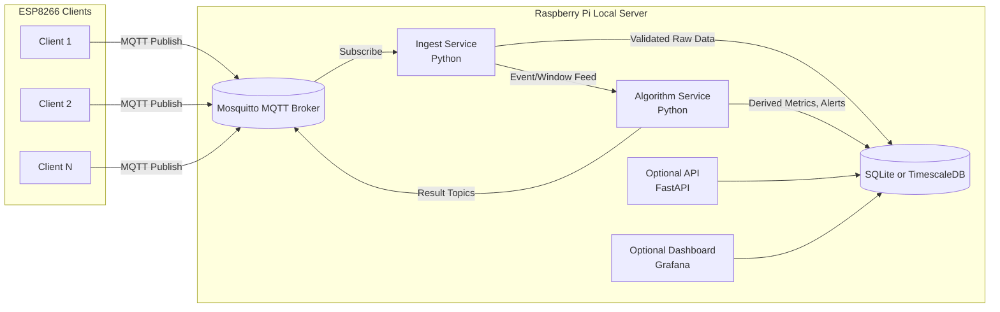
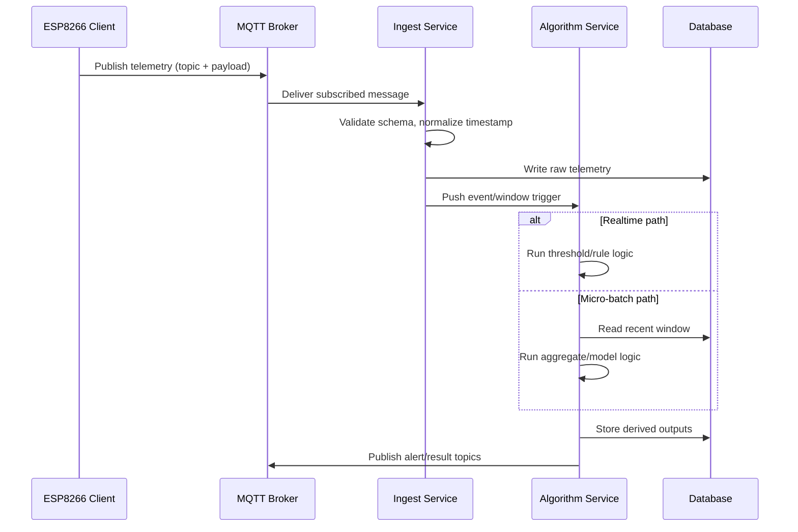
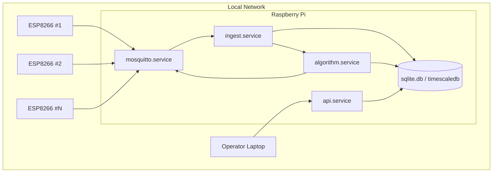
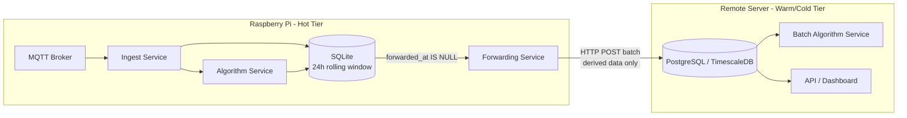

# Draft Design Doc: Raspberry Pi Local Telemetry Server

## 1. Purpose

Design a local-network backend running on a Raspberry Pi that can:

- Collect telemetry from multiple ESP8266 clients.
- Store raw and derived data reliably.
- Run algorithms on-device (on the Pi) for real-time and periodic analysis.
- Expose outputs for monitoring, control, and future integrations.

This draft is based on the recommended architecture:

- MQTT broker for ingestion.
- Python processing services for validation and algorithm execution.
- Local database for persistence.
- Optional API/dashboard for operations visibility.

## 2. Scope

### In Scope

- LAN-only deployment model.
- Multi-client telemetry ingest.
- Real-time and micro-batch algorithm execution.
- Baseline reliability and security controls.
- A phased implementation plan.

### Out of Scope (for first draft)

- Cloud synchronization.
- Enterprise authentication/authorization stack.
- Fleet-scale orchestration (Kubernetes, etc.).

## 3. High-Level Architecture



## 4. Recommended Stack

### Phase-1 Default

- Message Broker: Mosquitto (MQTT)
- Ingest + Algorithm Runtime: Python (asyncio, paho-mqtt or equivalent)
- Storage: SQLite
- Service Management: systemd or Docker Compose
- Service Configuration: algorithm service host/port must be in an external config file (not hardcoded) so it can be redirected to a remote host without code changes when tiered storage is adopted.

### Growth Path

- Replace SQLite with PostgreSQL/TimescaleDB when volume and retention complexity increase.
- Add Redis when short-term buffering or inter-service pub/sub is needed.
- Add Grafana once ingestion and algorithm outputs are stable.

## 5. Data Flow and Processing Model



## 6. Topic and Payload Draft

### Topic Convention

Use a deterministic hierarchy:

- `site/<device_id>/<sensor_type>` for telemetry
- `site/<device_id>/status` for online/health
- `site/<device_id>/result/<algo_name>` for derived outputs

Example:

- `site/lab01/esp_12e_003/temp`
- `site/lab01/esp_12e_003/result/anomaly_score`

### Payload Convention (JSON v1)

```json
{
  "schema_version": 1,
  "device_id": "esp_12e_003",
  "ts": "2026-05-03T14:22:11Z",
  "seq": 18421,
  "metrics": {
    "voltage": 3.31,
    "current": 0.128,
    "power": 0.423
  }
}
```

Notes:

- Keep `seq` monotonic per device for dedupe and drop detection.
- Use UTC timestamps on all persisted events.
- Start with JSON for readability; optimize later only if required.
- Include a `forwarded_at` column (nullable) on all raw telemetry DB rows. Costs nothing now; gives the future forwarding service a reliable cursor for crash-safe resume without full table scans.

## 7. Algorithm Execution Strategy

### Realtime Layer

- Trigger per message.
- Run lightweight threshold/rule checks.
- Emit immediate alerts and status updates.

### Micro-Batch Layer

- Run every 1-10 seconds.
- Aggregate short windows for smoothing/noise reduction.
- Compute heavier metrics, trend features, anomaly scores.

### Hybrid Default

- Realtime checks for safety/operational alerts.
- Periodic batch analytics for richer insights.

## 8. Storage Strategy

### Initial

- SQLite on local SSD/SD card for simple deployment.
- Separate tables for raw telemetry, derived metrics, and alert events.

### Scale-up Trigger

Migrate to PostgreSQL/TimescaleDB when:

- write throughput increases,
- retention policy complexity grows,
- historical query performance becomes limiting.

## 9. Reliability and Security Controls

### Reliability

- MQTT QoS 1 for important telemetry.
- Broker persistence enabled.
- Device reconnect with exponential backoff.
- Idempotent ingest writes using `(device_id, ts, seq)` uniqueness.
- Dead-letter handling for malformed payloads.

### Security (LAN)

- Per-device MQTT credentials.
- TLS transport when practical.
- Restrict topic ACLs by device identity.
- Isolate IoT segment (VLAN/subnet) where possible.

## 10. Deployment View



## 11. Phased Delivery Plan

### Phase 1: Foundation (1-2 days)

- Install and configure Mosquitto.
- Implement single ingest worker.
- Persist telemetry to SQLite.
- Implement one baseline algorithm and log outputs.

### Phase 2: Hardening

- Add payload schema validation and dead-letter route.
- Add service supervision (systemd or Compose restart policies).
- Add basic dashboard and operational health metrics.

### Phase 3: Scale and Model Ops

- Migrate to TimescaleDB if needed.
- Add retention/downsampling jobs.
- Add model versioning and offline evaluation workflow.

## 12. Risks and Mitigations

- SD card wear from high write rates.
  - Mitigation: use external SSD or tune fsync/batch writes.
- CPU contention under heavy algorithm load.
  - Mitigation: isolate worker process priorities, micro-batch expensive tasks.
- Message duplication/reordering.
  - Mitigation: sequence numbers and idempotent writes.
- Weak LAN trust assumptions.
  - Mitigation: credential rotation, ACLs, optional TLS, network segmentation.

## 13. Future Feature: Tiered Storage and Remote Forwarding

> **Status: Not in scope for current implementation. The design-now decisions above (`forwarded_at` column, externalised service config, stateless ingest service) are sufficient to enable this without refactoring when needed.**

### Motivation

As telemetry volume grows the Pi will eventually reach disk capacity. Rather than retaining all data indefinitely, the Pi operates as a hot-tier edge node with a 24-hour rolling window; a remote server holds the warm/cold-tier long-term store. Only post-processed or derived data is forwarded upstream — not necessarily all raw telemetry — giving flexibility to control data volume and sensitivity.

### Tiered Storage Model

| Tier | Host | Retention | Contents |
|---|---|---|---|
| Hot | Raspberry Pi | 24 hours rolling | Raw telemetry + realtime algorithm outputs |
| Warm/Cold | Remote Server | Long-term | Forwarded processed/derived data only |

### Architecture



### Forwarding Microservice Behaviour

- Runs as an independent service (`forwarder.service`) — does not block ingest or algorithm services.
- Queries Pi DB for rows where `forwarded_at IS NULL`.
- Applies a configurable transform/filter: sends derived metrics and aggregates by default; raw telemetry forwarding is opt-in per topic.
- POSTs batches to an HTTP endpoint on the remote server.
- On success, sets `forwarded_at = NOW()` on sent rows.
- On failure, retries with exponential backoff.
- Pi retention job runs independently: purges raw telemetry older than 24 hours regardless of forwarding state.

### What the Remote Server Needs

- HTTP ingest endpoint to receive forwarded batches.
- PostgreSQL or TimescaleDB for long-term storage.
- Optional batch algorithm service for historical processing.
- Optional Grafana for long-term dashboards.

### Design-Now Decisions That Enable This

- `forwarded_at` nullable column on raw telemetry rows (Section 6).
- Algorithm service host in external config (Section 4).
- Ingest service stateless — no in-memory caches that cannot be reconstructed.

## 14. Open Decisions

- Final database choice for production: SQLite vs TimescaleDB.
- Service runtime model: native systemd vs Docker Compose.
- Algorithm package boundaries: single worker vs separate realtime and batch services.
- Dashboard/API requirement for first milestone.
- Remote server technology when tiered storage is adopted (PostgreSQL vs TimescaleDB vs InfluxDB).
- Forwarded payload schema: derived metrics only vs configurable raw+derived per topic.

## 15. Suggested Next Steps

1. Approve topic naming and JSON schema v1.
2. Finalize Phase-1 storage choice (SQLite recommended).
3. Implement a minimal proof-of-concept with 2-3 ESP clients.
4. Measure ingest rate, algorithm latency, and storage growth for one test day.
