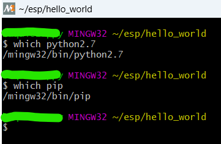
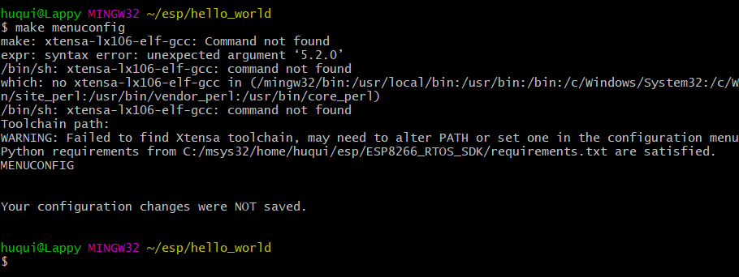
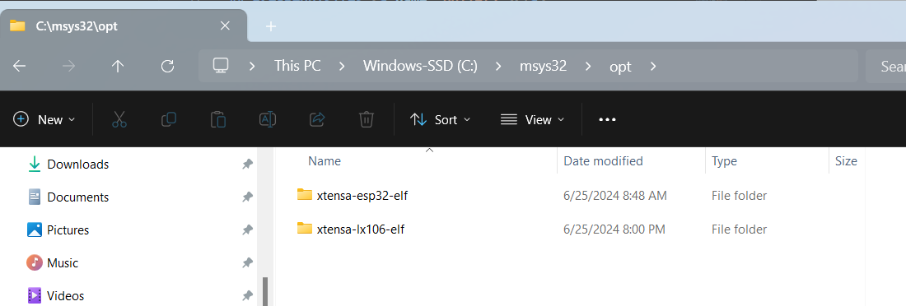

# ESP8266 Projects with RTOS SDK


# Table of contents
1. [Introduction](#bullet1)
    1. [ESP8266 Project Links](#bullet1.1)
        1. [Hello World](#bullet1.1.1)
        2. [Test Tasks](#bullet1.1.2)
        3. [Solar Panel](#bullet1.1.3)
2. [Pre-Requisites](#bullet2)
    1. [ESP8266 RTOS SDK](#bullet2.1)
    2. [Issues Compiling](#bullet2.2)
        1. [Python Version](#bullet2.2.1)
        2. [Python Requirements](#bullet2.2.2)
        3. [Xtensa Compiler](#bullet2.2.3)

## Introduction <a name="bullet1"></a>
This repo contains projects created on the ESP8266 with RTOS.

### ESP8266 Project Links <a name="bullet1.1"></a>

These are the projects created for the ESP8266 using the RTOS-SDK

#### Hello World <a name="bullet1.1.1"></a>
The [hello_world](/hello_world) project is the one provided in the ESP8266 [examples](/ESP8266_RTOS_SDK/examples) folder.


#### Test Tasks <a name="bullet1.1.2"></a>
The [testTasks](/testTasks) project implements a method of tracking cuurrently executing tasking using an SMDBus like protocol on GPIO pins 0 & 2.

#### Solar Panel <a name="bullet1.1.3"></a>
The [solar_panel](/solar_panel/) project simply measures power output of a 1w solar panel.

## Pre-Requisites <a name="bullet2"></a>
The following pre-requisites are required to be able to compile and use this tool.


### ESP8266 RTOS SDK <a name="bullet2.1"></a>
Using the [ESP32 RTOS SDK Programming Guide](https://docs.espressif.com/projects/esp8266-rtos-sdk/en/latest/get-started/index.html#) follow the entire process for your respective OS, e.g. Windows, Mac, Linux. This includes setting up toolchain, cloning ESP8266_RTOS_SDK repo, and copying/compiling hello_world project. 


### Issues Compiling <a name="bullet2.2"></a>

Some issues encountered while compiling are listed below, Windows Toolchain Only! (Mac and Linux installs dont have to deal with MSYS)

#### Python Version <a name="bullet2.2.1"></a>

While compiling within the mingw32 environment ensure that the correct python and pip versions will be invoked. The invoked versions should be within the ```mingw32/bin``` folder.



#### Python Version <a name="bullet2.2.1"></a>

While compiling within the mingw32 environment ensure that the correct python and pip versions will be invoked. The invoked versions should be within the ```mingw32/bin``` folder.


#### Xtensa Compiler <a name="bullet2.2.2"></a>

If you are getting an issue when calling ```make menuconfig``` and receive the following error message.

```make: xtensa-lx106-elf-gcc: Command not found```



Then follow instructions below:

After downloading the ```xtensa-lx106-elf``` ```.zip``` or ```.tar.gz```  as instructed in the [Windows Toolchain Setup](https://docs.espressif.com/projects/esp8266-rtos-sdk/en/latest/get-started/windows-setup.html#download-the-toolchain-for-the-esp8266), extract the ```xtensa-lx106-elf``` folder into your ```msys32/opt folder```


 
 Your ```msys32/opt``` folder should now look like below.



Next follow steps 2 & 3  in the [Linux Toolchain Setup](https://docs.espressif.com/projects/esp8266-rtos-sdk/en/latest/get-started/linux-setup.html#toolchain-setup) and ```make``` should now be able to invoke ```xtensa-lx106-elf-gcc```.


