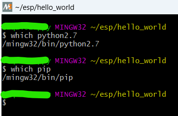
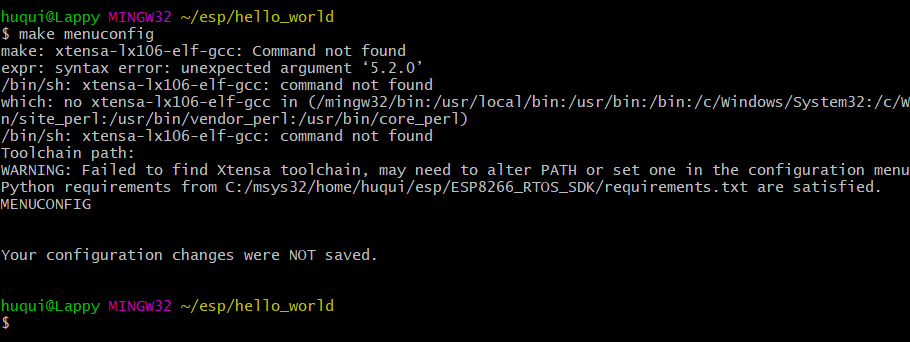
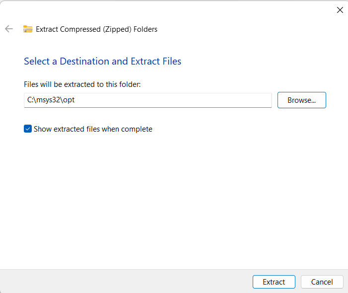
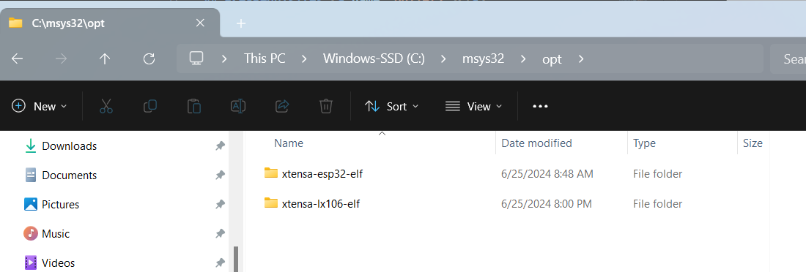

<div align="center">

<!--
  

  -->
  <h1>ESP8266 Projects</h1>
  
  <p>
    Projects using the ESP8266_RTOS_SDK
  </p>
  
<!-- Badges -->
<p>
  <a href="https://github.com/Louis3797/awesome-readme-template/graphs/contributors">
    
  </a>
  <a href="">
    
  </a>
  <a href="https://github.com/Louis3797/awesome-readme-template/network/members">
    
  </a>
  <a href="https://github.com/Louis3797/awesome-readme-template/stargazers">
    
  </a>
  <a href="https://github.com/Louis3797/awesome-readme-template/issues/">
    
  </a>
  <a href="https://github.com/Louis3797/awesome-readme-template/blob/master/LICENSE">
    
  </a>
</p>
   
<h4>
    <a href="https://github.com/Louis3797/awesome-readme-template/">View Demo</a>
  <span> · </span>
    <a href="https://github.com/Louis3797/awesome-readme-template">Documentation</a>
  <span> · </span>
    <a href="https://github.com/Louis3797/awesome-readme-template/issues/">Report Bug</a>
  <span> · </span>
    <a href="https://github.com/Louis3797/awesome-readme-template/issues/">Request Feature</a>
  </h4>
</div>

<br />

<!-- Table of Contents -->
# Table of Contents

- [About the Project](#about-the-project)
  * [Tech Stack](#tech-stack)
  * [Features](#features)
  * [Environment Variables](#environment-variables)
- [Getting Started](#getting-started)
  * [Prerequisites](#prerequisites)
  * [Installation](#installation)
  * [Run Locally](#run-locally)
- [Usage](#usage)
- [Roadmap](#roadmap)
- [Contributing](#contributing)
  * [Code of Conduct](#code-of-conduct)
- [License](#license)
- [Contact](#contact)
- [Acknowledgements](#acknowledgements)
  

<!-- About the Project -->
## About the Project

This repository serves as a base project for various ESP8266-based subprojects. It provides a common structure, setup instructions, and shared resources to streamline development and documentation for each subproject. The goal is to make it easy to start new ESP8266 projects, share code, and maintain consistency across related efforts. Current subprojects include tools like a solar meter and other IoT experiments.


<!-- TechStack -->
### Tech Stack

<details>
  <summary>Client</summary>
  <ul>
    <li><a href="https://docs.espressif.com/projects/esp8266-rtos-sdk/en/latest/">ESP8266_RTOS_SDK</a></li>
    <li><a href="https://mqtt.org/">MQTT</a></li>
  </ul>
</details>

<details>
  <summary>Server</summary>
  <ul>
    <li><a href="https://www.raspberrypi.com/">Raspberry Pi OS</a> (or Yocto-based image)</li>
    <li><a href="https://mqtt.org/">MQTT Broker (e.g., Mosquitto)</a></li>
    <li><a href="https://www.python.org/">Python</a></li>
  </ul>
</details>

<details>
<summary>Database</summary>
  <ul>
  <li><a href="https://www.sqlite.org/index.html">SQLite</a></li>
  <li><a href="https://www.mysql.com/">MySQL</a> (or MariaDB)</li>
  <li>Any lightweight database compatible with Raspberry Pi</li>
  </ul>
</details>

<details>
<summary>DevOps</summary>
  <ul>
  <li><a href="https://www.docker.com/">Docker</a></li>
  <li><a href="https://clickup.com/">ClickUp</a> (for project management)</li>
  <li><a href="https://github.com/features/actions">GitHub Actions</a> (CI/CD pipeline)</li>
  <li><a href="https://www.anaconda.com/">Anaconda</a> or <a href="https://github.com/cmmid/conda_micro">Microconda</a> (for Python environment management)</li>
  </ul>
  
</details>

<!-- Features -->
### Features

- **[Solar Meter Project](/solar_panel/)** – Solar Metering project for tracking and monitoring solar energy in different environments.

- **[Test Tasks](/test_tasks/)** – Example tasks for testing ESP8266 features and SDK setup.
- **[I2C](/i2c/)** – Demonstrates I2C communication with sensors and peripherals.
- **[Hello World](/hello_world/)** – Minimal starter project to verify toolchain and SDK installation.


<!-- Getting Started -->
## Getting Started

<!-- Prerequisites -->
### Prerequisites

The following pre-requisites are required to be able to compile and use this tool.

#### Linux or Mac

For Mac and Linux users, follow the official [ESP8266_RTOS_SDK Get Started Guide](https://docs.espressif.com/projects/esp8266-rtos-sdk/en/latest/get-started/index.html#installation-step-by-step) for step-by-step instructions on installing all required dependencies and setting up the toolchain.

#### Windows Users Only

Windows users will need to compile programs in a virtual Linux environment. This can be accomplished using tools such as **WSL (Windows Subsystem for Linux)**, **Cygwin**, or **MSYS2**. **WSL** is the most recommended option as it is the easiest to set up and debug.

##### WSL (Windows Subsystem for Linux)

To install WSL (Windows Subsystem for Linux):

1. Open **PowerShell** as Administrator.
2. Run:  
  ```powershell
  wsl --install
  ```
3. Restart your computer if prompted.
4. On first launch, choose a Linux distribution (e.g., Ubuntu) and complete the setup.

For more details, see the [official Microsoft WSL guide](https://docs.microsoft.com/windows/wsl/install).

#### Anaconda or Microconda <a name="bullet2.1"></a>

Within the WSL or Linux/MAC environment it is recomended to install microconda in order to provide a Python2 sandbox environment within which the ESP8266_RTOS_SDK tools can be used.

##### MSYS2 MINGW

Alternatively, you can use [MSYS2](https://www.msys2.org/) to provide a Unix-like environment on Windows. 

1. Download and install MSYS2 from the [official website](https://www.msys2.org/).
2. Open the MSYS2 terminal and update the package database:
  ```bash
  pacman -Syu
  ```
3. Install required development tools (e.g., `make`, `git`, `python`):
  ```bash
  pacman -S base-devel git python
  ```
4. Follow the ESP8266 RTOS SDK instructions for Linux, using the MSYS2 terminal for all commands.

Refer to the [MSYS2 documentation](https://www.msys2.org/docs/) for more details.

Once installation of above dependencies is complete a user can clone or fork this repo into the WSL+Miniconda or Windows environment follow the guidelines in the [ESP32 RTOS SDK Programming Guide](https://docs.espressif.com/projects/esp8266-rtos-sdk/en/latest/get-started/index.html#). 

<!-- 
#### Docker <a name="bullet2.1"></a>

TODO: need to hash out these instructions -->

<!-- Run Locally -->
### Run Locally

Clone the project

```bash
  git clone git@github.com:hquiroz-1988/esp.git
```

Go to the project directory

```bash
  cd esp/SolarMeter
```

Install dependencies

```bash
  python -m pip install --user -r $IDF_PATH/requirements.txt
```

Flash MCU

```bash
  make flash
```


### Issues Compiling <a name="bullet2.2"></a>

Some issues encountered while compiling are listed below, Windows Toolchain Only! (Mac and Linux installs dont have to deal with MSYS)

##### Python Version <a name="bullet2.2.1"></a>

While compiling within the mingw32 environment ensure that the correct python and pip versions will be invoked. The invoked versions should be within the ```mingw32/bin``` folder.




##### Xtensa Compiler <a name="bullet2.2.2"></a>

If you are getting an issue when calling ```make menuconfig``` and receive the following error message.

```make: xtensa-lx106-elf-gcc: Command not found```



Then follow instructions below:

After downloading the ```xtensa-lx106-elf``` ```.zip``` or ```.tar.gz```  as instructed in the [Windows Toolchain Setup](https://docs.espressif.com/projects/esp8266-rtos-sdk/en/latest/get-started/windows-setup.html#download-the-toolchain-for-the-esp8266), extract the ```xtensa-lx106-elf``` folder into your ```msys32/opt folder```


 
 Your ```msys32/opt``` folder should now look like below.



Next follow steps 2 & 3  in the [Linux Toolchain Setup](https://docs.espressif.com/projects/esp8266-rtos-sdk/en/latest/get-started/linux-setup.html#toolchain-setup) and ```make``` should now be able to invoke ```xtensa-lx106-elf-gcc```.


<!-- Usage -->
## Usage


<!-- Use this space to tell a little more about your project and how it can be used. Show additional screenshots, code samples, demos or link to other resources.


```javascript
import Component from 'my-project'

function App() {
  return <Component />
}
``` -->

<!-- Roadmap -->
## Roadmap

* [x] Create Project README
* [ ] Further Containerize the project


<!-- Contributing -->
## Contributing

<a href="https://github.com/Louis3797/awesome-readme-template/graphs/contributors">
</a>

<!-- Code of Conduct
### Code of Conduct

Please read the [Code of Conduct](https://github.com/Louis3797/awesome-readme-template/blob/master/CODE_OF_CONDUCT.md) -->


<!-- License -->
## License

Distributed under the no License. See LICENSE.txt for more information.


<!-- Contact
## Contact

Your Name - [@twitter_handle](https://twitter.com/twitter_handle) - email@email_client.com

Project Link: [https://github.com/Louis3797/awesome-readme-template](https://github.com/Louis3797/awesome-readme-template) -->

<!-- Acknowledgments -->
## Acknowledgements

 - [Awesome README Template](https://github.com/Louis3797/awesome-readme-template)