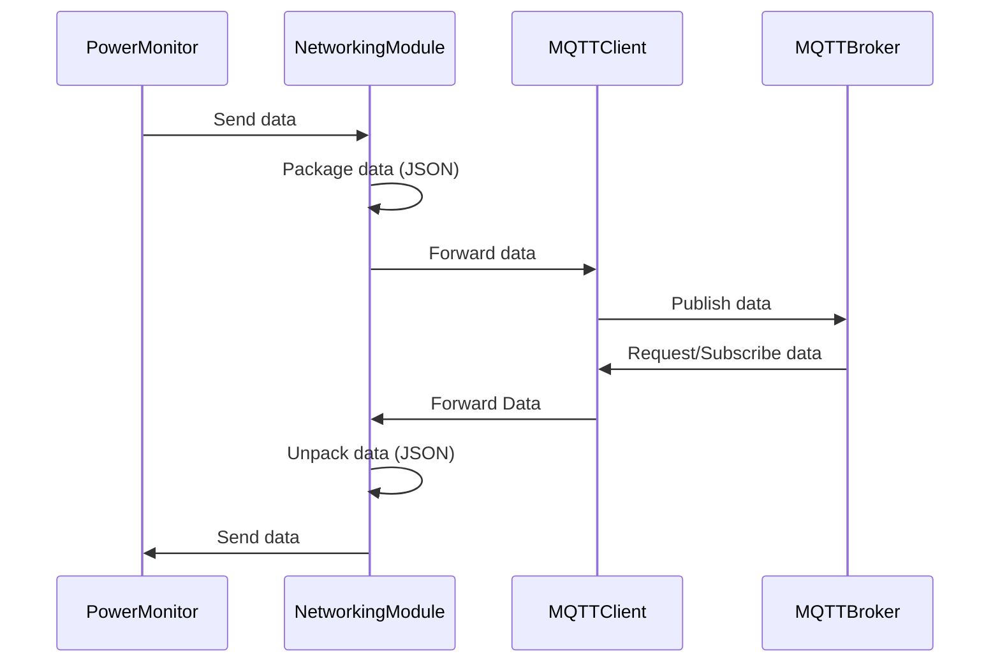
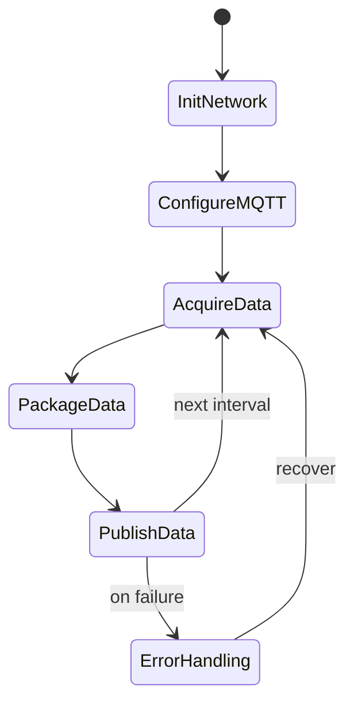
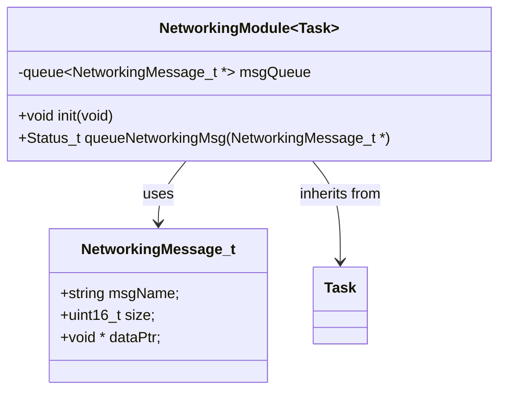

# Application Note: Networking Module

## Table of Contents
- [Overview](#overview)
- [Sequence Diagram](#sequence-diagram)
- [State Machine Diagram](#state-machine-diagram)
- [Class Diagram](#class-diagram)
- [Conclusion](#conclusion)

### Overview

The Networking Module is responsible for collecting, packaging, and transmitting system data to a central Broker. It ensures reliable communication between distributed modules, such as the Power Monitor and Current Monitor, and external systems.

The Networking Module interfaces with other system modules along with the MQTT instance to receivea and transmit data.

### Sequence Diagram

The Networking Module follows the following state machine.

### State Machine Diagram

The Networking Module uses the following interface

### Class Diagram

### Conclusion

The Networking Module provides a robust mechanism for real-time data exchange, enabling monitoring and control of the Solar Meter system from remote locations.
