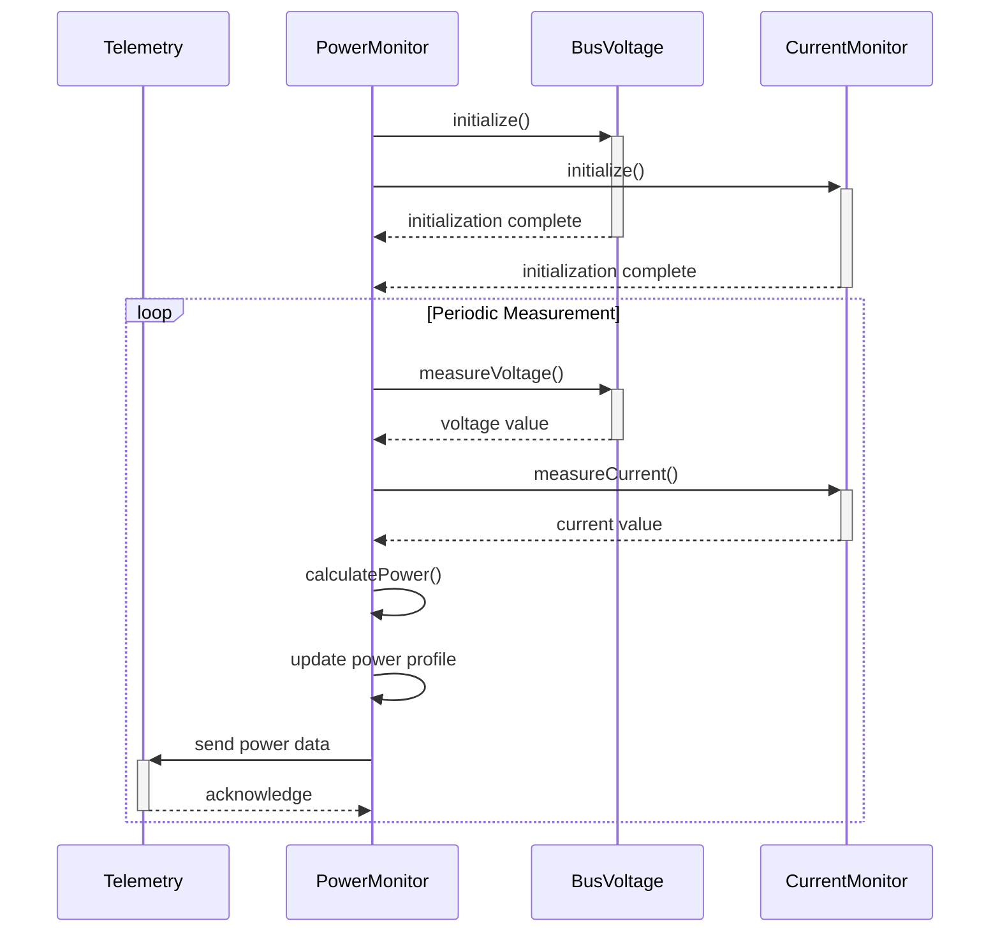
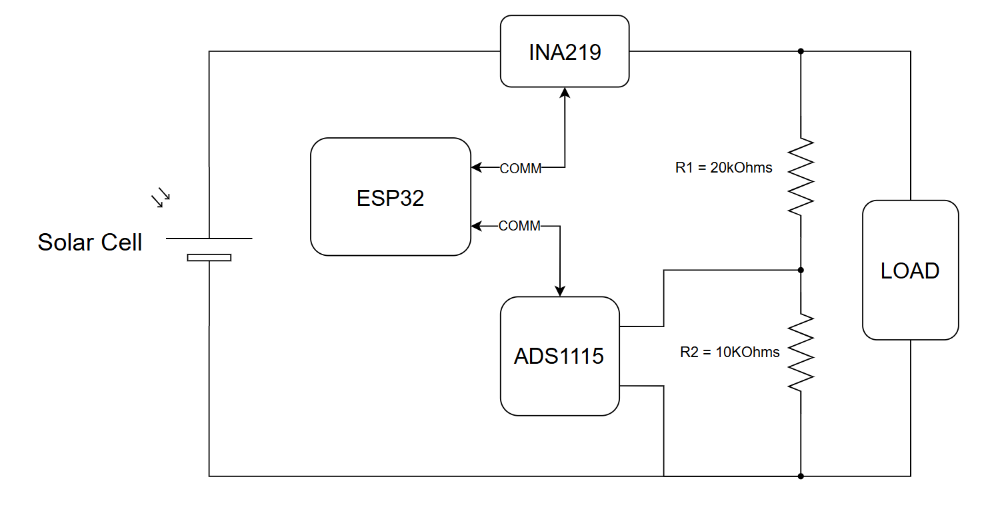
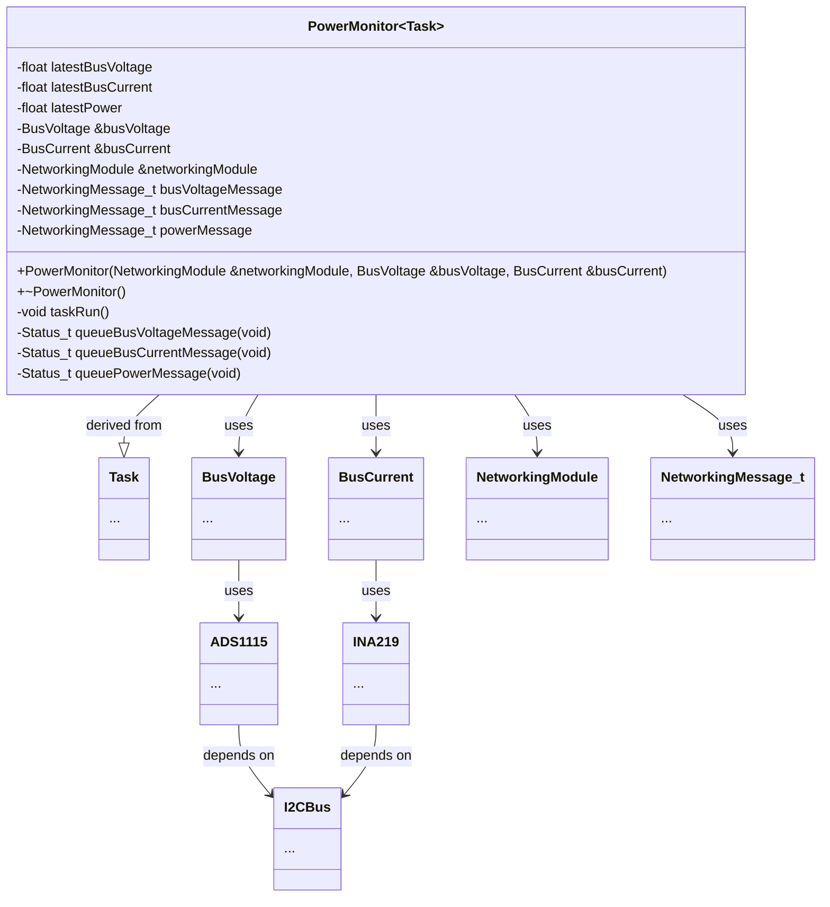
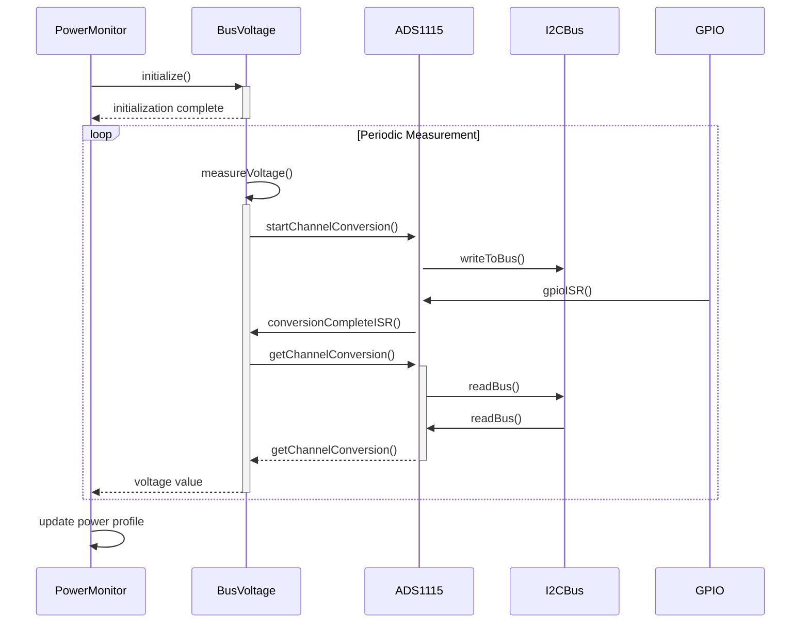
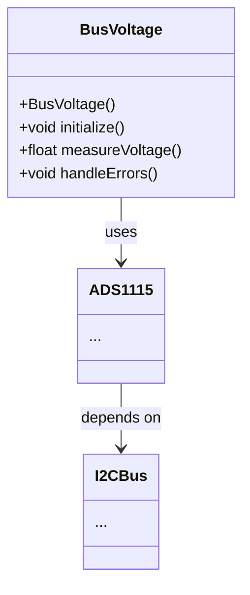
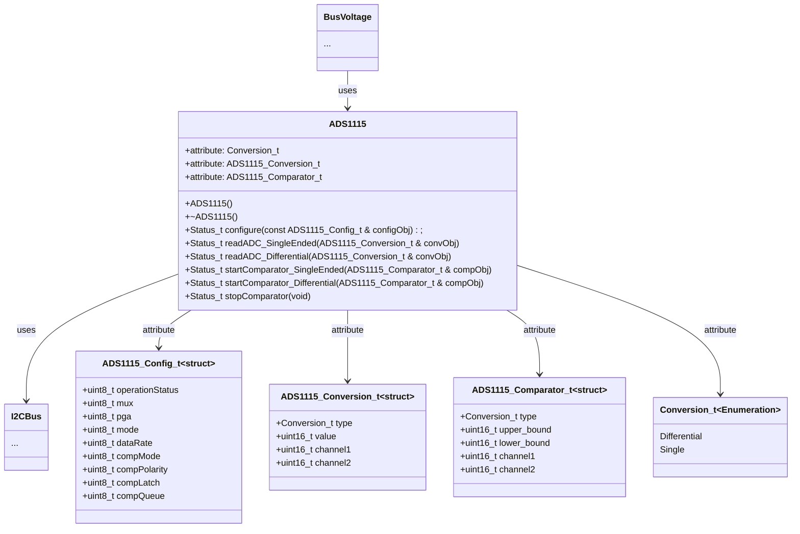
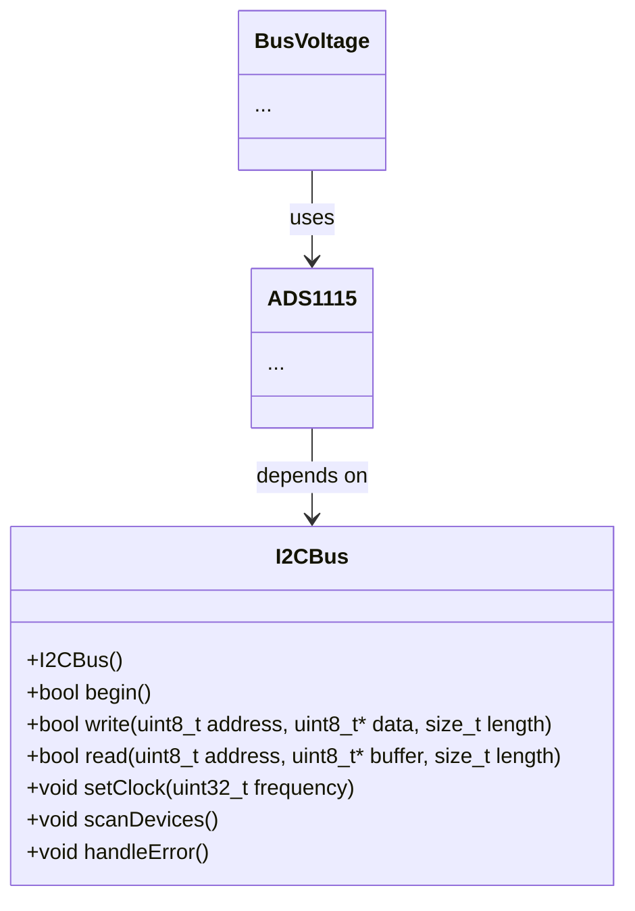

# Application Note: Power Monitor Module

## Table of Contents

- [Overview](#overview)
- [Components](#components)
    - [Bus Voltage](#bus-voltage)
        - [Overview](#overview-1)
        - [Dependencies](#dependencies)
            - [ADS1115](#ads1115)
            - [I2C Bus](#i2c-bus)
        - [Implementation Steps](#implementation-steps)
        - [Conclusion](#conclusion)
    - [Current Monitor Module](#current-monitor-module)
- [Implementation Steps](#implementation-steps-1)
- [Conclusion](#conclusion-1)

## Overview

This application note describes the implementation of a Power Monitor Module for the Solar Meter Project. The module measures both the bus voltage and output current to compute real-time power usage. It integrates the Bus Voltage Module and the Current Monitor Module, both utilizing the ADS1115 analog-to-digital converter (ADC) over the I2C bus for high-precision measurements.

The Power Monitor Module periodically samples voltage and current, calculates power, this data is then periodically sent to the Telemetry Module.

The following sequence diagram illustrates the interaction between the Power Monitor, Bus Voltage, Telemetry, and Current Monitor modules:

The schematic below shows the circuit diagram for measuring both bus voltage and current.

The block diagram below shows the Power Monitor class interface and its dependencies.

## Components

### Bus Voltage

#### Overview

This application note provides guidance on monitoring the bus voltage generated by the solar panel module. This bus voltage is used to characterize the amount of power produced by the solar panel. Voltage measurements are collected using the ADS1115 analog-to-digital converter (ADC), which communicates via the I2C protocol and must be connected to an I2C module. The ADS1115 is a 16-bit ADC that offers high precision and flexibility for voltage measurement applications.

Bus Voltage module is used by the Power Monitor Module to create a time based power profile of the solar panel system.

The following sequence diagram shows the interaction between the Power Monitor module and the Bus Voltage module.

The schematic below shows the circuit diagram used to measure the bus voltage. 

<!-- !TODO: only show ads1115 diagram -->

The block diagram below shows the Bus Voltage class interface and its dependencies.

#### Dependencies
##### ADS1115
- **Description**: A 16-bit ADC with programmable gain amplifier (PGA) for precise voltage measurements.
- **Features**:
    - Single-ended or differential input modes.
    - Configurable data rate.
    - Built-in comparator for threshold-based alerts.

##### I2C Bus
- **Description**: A two-wire communication protocol used to interface with the ADS1115.
- **Features**:
    - Supports multiple devices on the same bus.
    - Simple wiring with SDA (data line) and SCL (clock line).

#### Implementation Steps
1. **Hardware Setup**:
     - Connect the ADS1115 to the I2C bus of your microcontroller.
     - Ensure proper pull-up resistors on SDA and SCL lines.

2. **Software Configuration**:
     - Initialize the I2C interface on your microcontroller.
     - Configure the ADS1115 registers for desired measurement mode and gain.

3. **Voltage Measurement**:
     - Read the ADC values from the ADS1115 via I2C.
     - Convert the raw ADC values to voltage using the configured gain and reference voltage.

4. **Error Handling**:
     - Implement checks for I2C communication errors.
     - Handle out-of-range voltage readings gracefully.

#### Conclusion
By leveraging the ADS1115 and I2C protocol, precise bus voltage monitoring can be achieved with minimal hardware and software complexity. This setup is ideal for applications requiring reliable voltage measurements.

### Current Monitor Module
- **Description**: Measures the output current from the solar panel, typically using a shunt resistor and the ADS1115 ADC.
- **Features**:
    - Differential measurement for accurate current sensing.
    - Configurable gain for various current ranges.
    - Error detection for sensor faults.

## Implementation Steps

1. **Hardware Setup**:
    - Connect the ADS1115 to the I2C bus of your microcontroller.
    - Connect voltage divider for bus voltage measurement.
    - Connect shunt resistor for current measurement.
    - Ensure proper pull-up resistors on SDA and SCL lines.

2. **Software Configuration**:
    - Initialize the I2C interface.
    - Configure the ADS1115 for voltage and current channels, setting appropriate gain.

3. **Measurement Cycle**:
    - Read bus voltage and current values from the ADS1115.
    - Convert raw ADC values to physical units (volts, amps).
    - Calculate power as `Power = Voltage × Current`.

4. **Error Handling**:
    - Check for I2C communication errors.
    - Handle out-of-range or invalid sensor readings.

## Conclusion

The Power Monitor Module combines bus voltage and current measurements to provide accurate, real-time power profiling for solar panel systems. Using the ADS1115 and I2C protocol ensures high precision and reliability with minimal hardware complexity.
