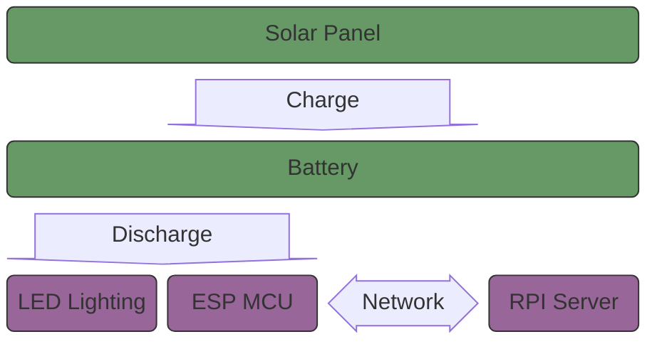
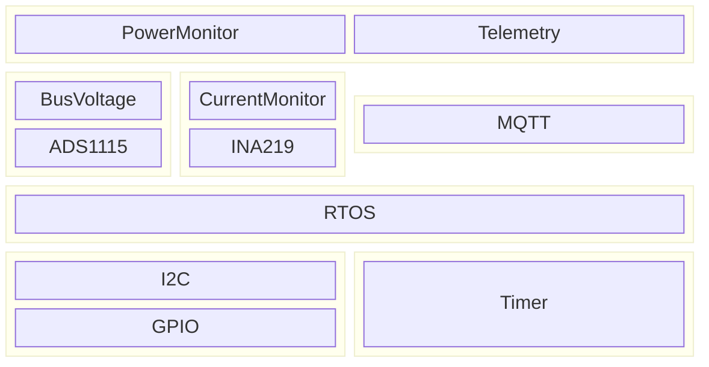

# Sunlight Meter

## Table of Contents
- [Introduction](#introduction)
- [System Diagram](#system-diagram)
- [Circuit Diagram](#circuit-diagram)

## Introduction
This project seeks to use a small 1 watt solar panels to characterize the amount of sunlight in a given area. This data will ultimately be collected and analyzed to determine the best area to place plants with varying sunlight requirements i.e. low, mid, full.

## System Diagram
The following diagram describes the connections between sub-systems. These are the solar panel, discharge load, ESP32 (client), and RPI (server).

## Circuit Diagram
The following circuit diagram describes the interface between solar panel, battery cell/s, ADS1115 ADC, INA219 Current Sensor, and the ESP32 Module.

## ESP32 Module Overview

### ESP32 Modules

For more information about each module, refer to the Application Notes listed below.

- **[PowerMonitor](/solar_meter/Documents/AppNotes/PowerMonitor.md)**: Handles voltage and current sensing from the solar panel and battery.
- **[Telemetry](/solar_meter/Documents/AppNotes/Telemetry.md)**: Manages data collection and communication with the server via MQTT.
- **[Lighting](/solar_meter/Documents/AppNotes/Lighting.md)**: Controls the LED lighting based on system logic and sensor data.

## RPI Server Module Overview

tbd

