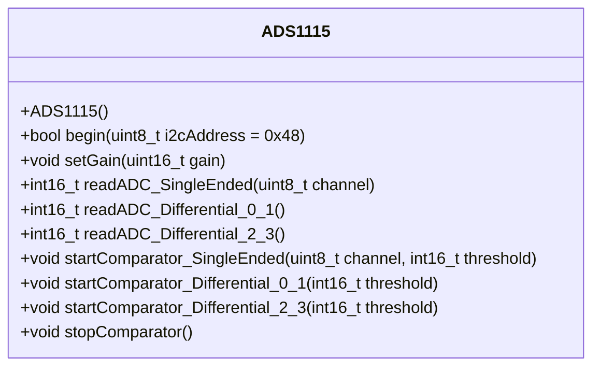

# Application Note: Bus Voltage Monitoring

## Overview
This application note provides guidance on monitoring bus voltage using the ADS1115 analog-to-digital converter (ADC) and the I2C communication protocol. The ADS1115 is a 16-bit ADC that offers high precision and flexibility for voltage measurement applications.

## Dependencies
### ADS1115
- **Description**: A 16-bit ADC with programmable gain amplifier (PGA) for precise voltage measurements.
- **Features**:
    - Single-ended or differential input modes.
    - Configurable data rate.
    - Built-in comparator for threshold-based alerts.

### I2C Bus
- **Description**: A two-wire communication protocol used to interface with the ADS1115.
- **Features**:
    - Supports multiple devices on the same bus.
    - Simple wiring with SDA (data line) and SCL (clock line).

## Implementation Steps
1. **Hardware Setup**:
     - Connect the ADS1115 to the I2C bus of your microcontroller.
     - Ensure proper pull-up resistors on SDA and SCL lines.

2. **Software Configuration**:
     - Initialize the I2C interface on your microcontroller.
     - Configure the ADS1115 registers for desired measurement mode and gain.

3. **Voltage Measurement**:
     - Read the ADC values from the ADS1115 via I2C.
     - Convert the raw ADC values to voltage using the configured gain and reference voltage.

4. **Error Handling**:
     - Implement checks for I2C communication errors.
     - Handle out-of-range voltage readings gracefully.

## Conclusion
By leveraging the ADS1115 and I2C protocol, precise bus voltage monitoring can be achieved with minimal hardware and software complexity. This setup is ideal for applications requiring reliable voltage measurements.
