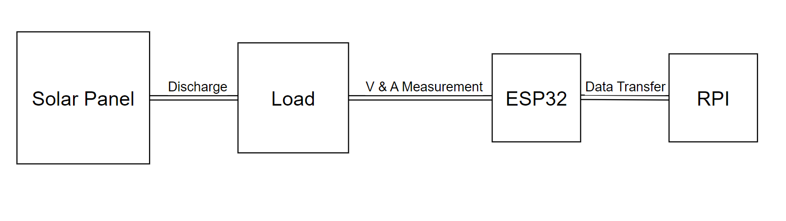
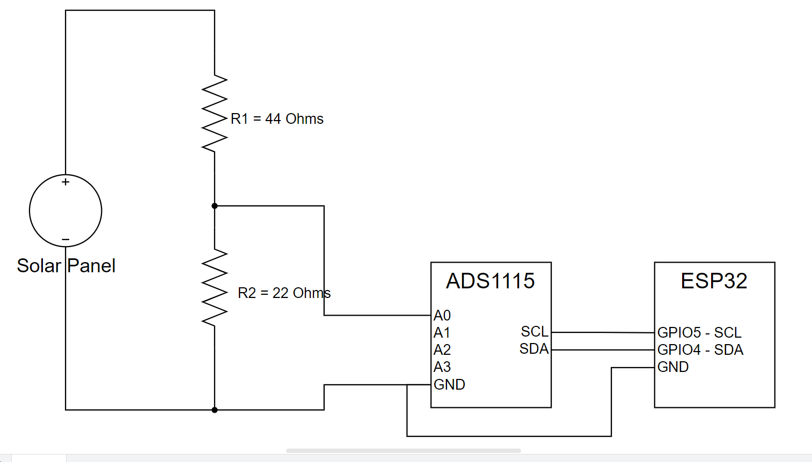

# Sunlight Meter

# ESP8266 Projects with RTOS SDK

# Table of contents
1. [Introduction](#bullet1)
2. [System Diagram](#bullet2)
2. [Circuit Diagram](#bullet2)

## Introduction 
This project seeks to use a small 1 watt solar panels to characterize the amount of sunlight in a given area. This data will ultimately be collected and analyzed to determine the best area to place plants with varying sunlight requirements i.e. low, mid, full.

## System Diagram 
The following diagram describes the connections between sub-systems. These are the solar panel, discharge load, ESP32 (client), and RPI (server).

## Circuit Diagram 
The following circuit diagram describes the physical connections between solar panel, discharge load, ADS1115 4-Chan ADC, and the ESP32 Module.

